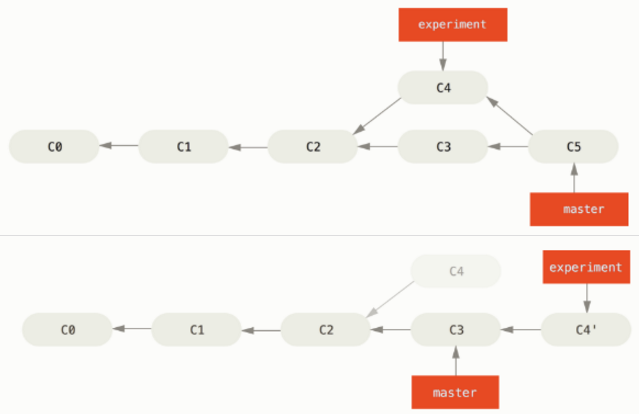

# Fragen CAS-FEE - Prüfungsvorbereitung

## [1] 04.05.2016: Git

### Was ist ein Git Commit?
von Hans Schenker - Donnerstag, 12. Mai 2016, 11:42

- Git Commit ist eine Sammlung (Set of changes) von Änderungen die mit dem Befehl: `git commit --m "message"` getätigt wird.
- Ein Commit ist mit einem 40stelligen eindeutigen identifier benannt (sha1).
- SHA-1 ist ein Algorithmus der die Daten der Änderungen als Input nimmt und daraus einen Hash generiert.
- Nach einem Commit wird der HEAD auf diesen letzten Commit im Branch gesetzt.
- Bei der Suche nach einem Commit müssen nicht alle 40 Stellen gesetzt werden. Meistens reichen die ersten 15 Stellen.

### Du hast eine ältere Git-Revision ausgecheckt und ein File geändert. Warum solltest du die Änderung nicht einchecken?
von David Heim - Sonntag, 8. Mai 2016, 14:34

Wenn du eine ältere Revision auscheckst, befindest du dich im "Detached Head"-Zustand. Damit kannst du frühere Versionen anschauen und experimentelle Änderungen machen. Du solltest aber nicht einchecken, weil nicht die Vergangenheit, sondern nur die aktuellste Version (HEAD) geändert werden sollte. Wenn du auf Basis einer älteren Version weiterentwickeln möchtest, kannst du einen Branch davon erstellen.

### In welchen Fällen ist es sinnvoll, Dateien mit .gitignore von der Versionierung auszunehmen (Beispiel) ?
von Marc Labud - Sonntag, 8. Mai 2016, 18:21

Alle Dateien, die nicht durch die Softwareentwickler des Projekts verändert werden, müssen nicht versioniert werden.
Dazu gehören z.B.
- log-files aus dem Betrieb
- im Buildprozess vom Präprozessor erstellte Dateien. (Bei der Entwicklung mit Typescript wären dies alle \*.js und \*.map Dateien)
- Pakete, die über das Internet heruntergeladen werden (über npm install installierte Pakete im Verzeichnis node_modules)
- Passwörter

### Was ist der unterschied zwischen „git pull“ und „git fetch“?
von Matthias Gemperli - 04.05.2016
- `git-fetch`  
lädt die neuen Daten herunter, aber integriert diese nicht. Man hat die Möglichkeit alle Änderungen zu sichten, die auf dem Remote Server gemacht wurden.
- `git pull`  
aktualisiert den aktuellen HEAD branch mit den letzten Änderungen vom Remote Server. Die Daten werden nicht nur heruntergeladen sondern auch direkt integriert.

### Wie kann eine Änderung einer Datei rückgängig gemacht werden ?
von Fabio Cavalera - Sonntag, 8. Mai 2016, 22:25

Falls noch kein Commit durchgeführt wurde, kann mittels `git checkout <Filename>` die Datei frisch vom Git-Repository geladen werden.

Wurde bereits ein Commit durchgeführt kann dieser mit dem Befehl `git revert` rückgängig gemacht werden.

### In welchen Fällen kann ein umschreiben der History sinnvoll sein und womit ist das möglich?
von Thilo Holzer - Montag, 9. Mai 2016, 10:25

`git rebase (-i interactive)` ermöglicht es, einzelne bzw. mehrere commits zusammenzufassen|verwerfen und somit die History des gewählten branches zu ändern. Das ist z.B. sinnvoll, wenn beim realisieren eines neuen Features nicht auf korrekte commit-Meldungen geachtet wurde und dies vor dem rückführen in den master korrigiert werden soll.

Dabei ist zu beachten, dass dies nicht auf einem "öffentlichen" branch geschehen sollte.

### Was versteht man unter "stashen" ?
von Philipp Bachmann - Dienstag, 10. Mai 2016, 20:40

Beim Stashen werden die aus dem Arbeitsverzeichnis noch nicht committeten Änderungen, also die geänderten Dateien und die in der Staging-Area enthaltenen Dateien, in einem Stack voller unfertiger Änderungen gespeichert. Diese können jederzeit wieder vom Stack geholt und auf den Arbeitsverzeichnis angewendet werden. Dazu kann der Befehl `git stash` verwendet werden.

### Worin unterscheidet sich Git von anderen herkömmlichen Versionskontrollen? Nenne dazu min. 4 Eigenschaften.
von Michel Rimbeaux - Mittwoch, 11. Mai 2016, 10:09

1. **Nicht-lineare Entwicklung**  
Sowohl das Erstellen neuer Entwicklungszweige (_branching_), als auch das Verschmelzen zweier oder mehrerer Zweige (_merging_) sind integraler Bestandteil der Arbeit mit Git und fest in die Git-Werkzeuge eingebaut

2. **Kein zentraler Server**  
Jeder Benutzer besitzt eine lokale Kopie des gesamten Repositorys, inklusive der Versionsgeschichte (history). So können die meisten Aktionen lokal und ohne Netzwerkzugriff ausgeführt werden.

3. **Datentransfer zwischen Repositorys**  
Daten können mit einer Reihe verschiedener Netzwerkprotokolle zwischen Repositorys übertragen werden wie z.B. ssh oder http/https oder eigenes sehr effizientes Protokoll git.

4. **Kryptographische Sicherheit der Projektgeschichte**  
Die Geschichte eines Projektes wird so gespeichert, dass der Hash einer beliebigen Revision (commit) auf der vollständigen Geschichte basiert, die zu dieser Revision geführt hat. Dadurch ist es nicht möglich, die Versionsgeschichte nachträglich zu manipulieren, ohne dass sich der Hash der Revision ändert.

5. **Interoperabilität**  
Es gibt Hilfsprogramme, die Interoperabilität zwischen Git und anderen Versionskontrollsystemen herstellen

6. **Verwaltung von Inhalt**  
Obwohl Git primär zur Versionsverwaltung von Quellcode entwickelt wurde, wird es auch zum Speichern von flach strukturierten (im Gegensatz zu relationalen Strukturen) Datensätzen direkt als Datei genutzt. Die Nutzung ist ähnlich NoSQL, auch wenn Git keine Indexstruktur, Abfrage oder Gleichzeitigkeit erlaubt.

### Was ist git-flow und wann macht es Sinn dieses zu verwenden.
von Thomas Brandenburger - Mittwoch, 11. Mai 2016, 13:56

Git-Flow ist ein Branchingmodell welches Git um eine einheitliche Struktur für Projekte erweitert. Dies macht vorallem Sinn wenn mehrere Entwickler an einem Projekt arbeiten. Durch die einzelnen parallel laufenden Branches können mehrere Features gleichzeitig entwickelt werden, sowie auch Releases vorbereitet werden und Hotfixes schnell und einfach durchgeführt werden.
Die sehr genaue Spezifizierung von git-flow hält den Workflow konstant und vereinfacht die einzelnen Entwicklungsprozesse.

Zu den bekannten Hauptbranches “master” und “develop” werden sogennante Support-Branches (Hotfixes, Feature, Release) erstellt, welche später auf verschiedene Art und Weise mit den Hauptzweigen “master” und “develop” automatisch zusammengeführt werden.

=> [Git flow cheat sheet|http://danielkummer.github.io/git-flow-cheatsheet/](http://danielkummer.github.io/git-flow-cheatsheet/)  
=> [Branching Model Git Flow|http://www.app-entwicklung.info/2014/12/das-branching-modell-git-flow/](http://www.app-entwicklung.info/2014/12/das-branching-modell-git-flow/)

### Worin unterscheden sich die Befehle "Rebase" und "Merge"
von Noel Bellón - Mittwoch, 11. Mai 2016, 14:28

Bei beiden Befehlen werden Codeänderungen von einem Branch mit einem anderen Branch zusammengeführt.

Beim "_merge_" werden die Codeänderungen von beiden Branches zusammengeführt und danach neu "commited". Die beiden zusammengeführten "Commits" bleiben in der History erhalten und werden entsprechend als Abzweigung dargestellt.

Beim "_rebase_" werden die Codeänderungen des einen Branches als Basis für die Codeänderungen des anderen Branches genommen und der zusammengeführte "Commit" wird nach dem "rebased" Commit in die History geschrieben. In der History wird nur noch der "rebased" Commit und der neue zusammengeführte Commit in einer Linie angezeigt. Mit dem "rebase" Befehl kann die History linear gehalten werden, jedoch wird die tatsächiche History dadurch verändert.

[Merging vs. Rebasing|https://www.atlassian.com/git/tutorials/merging-vs-rebasing/](https://www.atlassian.com/git/tutorials/merging-vs-rebasing/)  
[Visual Git Guide|https://marklodato.github.io/visual-git-guide/index-de.html](https://marklodato.github.io/visual-git-guide/index-de.html)

### Was ist bei Git mit einer "Arbeitskopie" gemeint und wie wird diese erstellt?
von Stefan Eugster - Mittwoch, 11. Mai 2016, 15:05

Eine Arbeitskopie ist eine lokale Kopie eines Git-Repositories mit welchem entwickelt werden kann. Über "git clone" wird die Arbeitskopie eines "Remote" Git-Repositories erstellt. Dabei wird das Repository mit der gesamten History lokal auf den Rechner geklont (kopiert).

Das Repository kann sich sowohl auf einem Dateiserver (git clone /pfad/zum/git-repository) oder entfernt auf einem Webserver (git clone benutzername@host:/pfad/zum/git-repository) befinden.

### Was (1) bewirkt das folgende Statement und (2) was bedeuten die beiden Trennstriche (--) im Statement? git checkout d1f3b2c -- test.txt
von Patrick Bonetti - Mittwoch, 11. Mai 2016, 19:24

`git checkout d1f3b2c -- test.txt`

1. Die Datei test.txt wird in den Zustand versetzt, der demjenigen des Commits d1f3b2c entspricht. So kann man z.B. einen früheren Zustand einer Datei wiederherstellen.

2. Die beiden separat stehenden Trennstriche bedeuten, dass alles was nach ihnen folgt keine Optionen des git-Befehls (hier: git checkout) sind. So könnte z.B. auch ein Datei- oder Branchname angegeben werden, der mit zwei Trennstrichen beginnt.  
Beispiel:  
`git branch -D -- --track` löscht einen Branch, der `--track` heisst.

### Was ist der Unterschied zwischen section und div in HTML?
von Isabel Steiner - Sonntag, 29. Mai 2016, 20:06

Der gebrauch von `<section>` zeigt, dass der Inhalt innerhalb des Tags zu einem Thema gehört und als ein Eintrag Gruppiert erscheinen soll.

`
` hat keine inhaltliche bedeutung und wird lediglich verwendet um CSS und JS hooks auf seinen Inhalt anzuwenden.

### Wie können z.B. zwei Commits, die bereits gepusht und publiziert wurden, wieder rückgängig gemacht werden? Was passiert dabei technisch gesehen?
von Raphael Hirscher - Sonntag, 23. Oktober 2016, 22:37

`git revert HEAD~2..HEAD`

Dieser Befehl führt einen neuen Commit aus, welcher die Änderungen der beiden vorhergehenden Commits zurücksetzt und publiziert.
