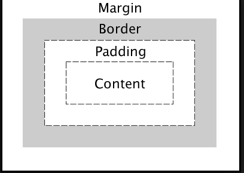

# Fragen CAS-FEE - Prüfungsvorbereitung

## [2a] 11.05.2016: Vorkurs HTML und CSS

### Auf welche drei Arten kann man CSS auf HTML anwenden?
von Tobias Buechel - Mittwoch, 11. Mai 2016, 19:21

* Inline-Styling: Direkt im HTML-Tag als Attribut  
`<input style="border: 1px solid blue">`

* Embedded Styling: Innerhalb vom HTML-Dokument mittels `<style>`-Tag  
```<style type="text/css">
input {
  border: 1px solid blue;
}
</style>
```

* External Stylesheet: Separates Dokument, das im Header vom HTML referenziert wird  
`<link rel="stylesheet" href="style.css" type="text/css">`

### Was ist eine CSS-Pseudo-Klasse und zeige ein Beispiel.
von Marcel Tinner - Mittwoch, 11. Mai 2016, 19:00

CSS-Pseudo-Klassen sind Keywords, welche an einen Selektor angefügt werden, um einen bestimmten Zustand desselben zu selektieren.

Bsp.: bei einem Mouseover könnte dies folgendermassen aussehen.

```
a:hover {
   color: green;
}
```

### Welche 7 Arten von Selektoren gibt es in CSS?
von Fabio Cavalera - Mittwoch, 18. Mai 2016, 17:34

| Selector | Example |
| ------------- |-------------|
| Element selector | p { } |
| Class selector | .green { } |
| ID selector | #example { } |
| Pseudo class selector | a:hover { } |
| Attribute selector | a[href]{ } |
| Universal selector | * {} |
| Pseudo-Elemente selector | a::before { } |

=> [CSS Selektoren|https://wiki.selfhtml.org/wiki/CSS/Selektoren](https://wiki.selfhtml.org/wiki/CSS/Selektoren)

### Welches ist die finale Reihenfolge für die Kaskade? (Wichtigste Deklaration am Schluss)
von Robert Stucki - Donnerstag, 12. Mai 2016, 08:22

Multiple Choice:

a.) User agent, User, Author, Author !important, User !important  
b.) User agent, Author !important, User !important, User, Author  
c.) User, User agent, Author, Author !important, User !important  

Richtige Antwort: a

### Selektor Spezifität
von Patrik Dietschweiler - Donnerstag, 12. Mai 2016, 09:04

Was für ein Spezifitätswert hat folgender Selektor:

`#mycontent.test[lang="fr"]:hover`

1. 103
2. 112
3. 121
4. 130

Antwort 4

```
#mycontent => ID = 100
.test => class = 10
[lang="fr"] => attribut = 10
:hover => pdeudo-klasse = 10
```

=> Man startet bei 0 und addiert 1000 für jedes style -Attribut (Inline Styles), 100 für jede
ID, 10 für jedes Attribut, Klasse oder Pseudo-Klasse und 1 für jedes Element und
Pseudo-Element.

### Welche 3 CSS Eigenschaften bestimmen das Aussehen einer Web Page?
von Hans Schenker - Donnerstag, 19. Mai 2016, 12:19

Es sind folgende 3 Eigenschaften:

- Das Box Model
- Die Display Property
- Die Box-Sizing Property

Box-Model:  
Das Boxmodell wird dazu verwendet, Breiten und Höhen von Elementen zu berechnen.
Die box-sizing CSS-Eigenschaft wird verwendet, um das Standard CSS Boxmodell zu verändern. Mögliche Settings zu box-sizing:

* content-box: nur content (ohne padding, obrder und margin) => default
* border-box: content + padding + border (ohne margin)



### Was sind Vendor-Prefixes und wozu wurden diese eingeführt?
von Thilo Holzer - Donnerstag, 12. Mai 2016, 16:50

Vendor-Prefixes sind Browser- bzw. Rendering-Engine spezifische CSS-Eigenschaften, welche zu Kompatibilitätszwecken eingeführt wurden.

Dies wurde nötig, weil die festgelegten Standards von den Browser-Herstellern unterschiedlich schnell adaptiert wurden (werden) und zum Teils auch noch nicht verabschiedete Standards implementiert werden.

Eigentlich ist der Prefix nur der erste Teil (z.B. -webkit-, -moz-, -o-, -ms-), der vor eine experimentelle oder nicht-standardisierte CSS-Eigenschaft gestellt wird.

### CSS-Selektor: Umfasst der CSS-Selektor den Paragraph mit dem Text "Hello World"?
von David Heim - Donnerstag, 12. Mai 2016, 18:28

```html
<div class="content">
  <div>
    <p>Hello World</p>
  </div>
</div>
```
CSS-Selektor:  
`.content > p`

a. Ja  
b. Nein

Antwort:  
b. Nein, der Selektor umfasst nur Paragraphs, die Child eines Elements mit der Klasse "content" sind. Der Paragraph im HTML-Snippet ist Child eines DIVs ohne Klasse. Child-Elemente sind immer direkt untergeordnet, ansonsten sind es Nachfahren (ancestors).

### Wie lassen sich folgende Styles mittels OOCSS abstrahieren und dadurch wiederverwendbar machen und wie heisst das Prinzip dahinter? Wende die Abstrahierung auf die HTML-Elemente an.
von Michel Rimbeaux - Donnerstag, 12. Mai 2016, 21:26

*Ausgangslage*
```css
.box-1 {
  border: 1px solid #ccc;
  width: 200px;
  height: 200px;
  border-radius: 10px;
}
.box-2 {
  border: 1px solid #ccc;
  width: 120px;
  height: 120px
  border-radius: 10px;
}
```

*Lösung: die visuellen Elemente werden in einer eigenen Klasse .box-border abstrahiert und dadurch wiederverwendbar*
```css
.box-1 {
  width: 200px;
  height: 200px;
}
.box-2 {
  width: 120px;
  height: 120px;
}
.box-border{
  border: 1px solid #CCC;
  border-radius: 10px;
}
```

*Die visuellen Elemente lassen sich nun auf unsere HTML-Elemente anwenden*
```html
<div class="box-1 box-border">Lorem ipsum</div>
<div class="box-2 box-border">Lorem ipsum</div>
```

→ OOCSS-Prinzip: Struktur und visuelle Elemente trennen

### CSS-Selektor
von Rafael Bamert - Freitag, 13. Mai 2016, 11:10

HTML
```html
<p>Paragraph 1</p>
<section>
    <p>Paragraph 2</p>
    <h2>Heading</h2>
    <p>Paragraph 3</p>
    <div>
        <p>Paragraph 4</p>
    </div>
    <p>Paragraph 5</p>
</section>
```

CSS
```
h2 ~ p {...}
```

Frage  
Welche(r) Paragraph(en) wird/werden selektiert?

Antwort:  
Paragraph 3 und 5. Es werden alle Paragraphen selektiert, die einen gemeinsamen Parent mit einem h2 haben (sibling von h2) und nach einem h2 kommen.

=> https://wiki.selfhtml.org/wiki/CSS/Selektoren/Kombinator 

### Was ist ein CSS Style Guide?
von Hans Schenker - Freitag, 13. Mai 2016, 13:56

Ziele eines CSS Styleguides sind:

- Erstelle Richtlinien für das schreiben von CSS und HTML Code.
- Gib Nicht-CSS-Experten eine Vorlage die sie in ihrem Projekt verwenden können
- Verhilft zu einem einheitlichen Stil im Layout einer Website

Tool für das Erstellen eines Css Style Guides: http://documentcss.com/

### Neue HTML5 Elemente
von Stefan Eugster - Montag, 16. Mai 2016, 08:27

Frage: Nenne 5 der neuen Elemente, welche mit HTML5 eingeführt wurden?

Sections:  
`<section>, <nav>, <article>, <aside>, <header>, <footer>, <main>`

Text-level semantics:  
`<time>`

Embedded content:  
`<video>, <audio>, <picture> (5.1)`

Forms:  
`<datalist>, <progress>`

Interactive elements:  
`<details> (5.1)`

=> [HTML5 Element List](https://developer.mozilla.org/de/docs/Web/HTML/HTML5/HTML5_element_list)

### Referenzierung eines CSS-Files
von Peter Bartholet - Montag, 16. Mai 2016, 18:57

Wie lautet die Referenzierung im HTML-Dokument auf ein CSS-File?

a) `<style src="EinStyleSheet.css">`  
b) `<link ref="stylesheet" type="text/css" href="EinStyleSheet.css">`  
c) `<stylesheet> EinStyleSheet.css</stylesheet>`  

Richtige Antwort:  
Antwort b

### Webbrowser haben bekanntlich die Eigenschaft CSS-Styles unterschiedlich zu rendern.
von Matthias Gemperli - Montag, 16. Mai 2016, 20:17

Was kann man dagegen tun?

- CSS Reset (z.B. normalize.css) verwenden, um bei allen Browsern eine ähnliche Darstellung zu erhalten

=> [Normalize CSS](http://nicolasgallagher.com/about-normalize-css/)

### Welche HTML Declaration bezeichnet ein HTML 5 Dokument.
von Benjamin Rüde - Dienstag, 17. Mai 2016, 15:19

a) `<!DOCTYPE HTML PUBLIC "-//W3C//DTD HTML 4.01//EN" "http://www.w3.org/TR/html4/strict.dtd">`  
b) `<!DOCTYPE html>`  
c) `<!DOCTYPE HTML PUBLIC "-//W3C//DTD HTML 5.0//EN" "http://www.w3.org/TR/html/5/strict.dtd">`  
d) `<!DOCTYPE html-5.0>`

Antwort:  
b)

### Weshalb ist der CSS-Selektor nav ul li a { … } von der Performance her schlecht einzustufen?
von Patrick Bonetti - Dienstag, 17. Mai 2016, 22:19

`nav ul li a { … }`

In diesem Beispiel werden mehrere descendant selectors (Verschachtelte Selektoren, Nachfahrenselektoren) verwendet. Da Browser CSS-Selektoren von rechts nach links abarbeiten, bewirkt dies, dass der Browser in mehreren Schritten vorgehen muss: Zuerst sucht der Browser alle a-Elemente im Dokument. Von diesen werden diejenigen verwendet, die in einem li-Element enthalten sind. Von diesen wiederum wird geprüft, ob sie in einem ul enthalten sind. Und schliesslich werden davon nur diejenigen ausgewählt, die auch in einem nav-Element enthalten sind. Dieser mehrstufige Vorgang ist entsprechend langsam.

Zudem werden in diesem Beispiel zwischen den descendant selecors nur Element-Selektoren verwendet, die per se schon weniger effizient sind als z.B. ID- oder Klassen-Selektoren.

### Welche Möglichkeiten gibt es um eine SVG Grafik einzubinden?
von Daniel Kellenberger - Mittwoch, 25. Mai 2016, 15:04

**SVG mittels `` einbinden**
```html

```  
(+) Grafik verhält sich wie ein Bild  
(-) Keine Links möglich bzw. Javascript Manipulationen  

**SVG mittels `<object>` Tag einbinden:**
```html
<object data="chart.svg" type="image/svg+xml" width="600" height="193">
  <!-- Für Browser ohne SVG-Unterstützung -->
  
</object>
```
(+) SVG Bild kann mit Links hinterlegt werden  
(+) Alternatives Bild kann angezeigt werden (für ältere Browser)  
(-) Keine Javascript Interaktion mit dem Objekt möglich

**SVG mittels CSS als Background einbinden.**
```html
<div style="background: url(pattern.svg);"> ... </div>
```
oder

```html
<div style="width:100%; height: 150px; background: url("data:image/svg+xml;utf8,<svg> ... </svg>")"> </div>
```
(-) Kein Resize  
(-) Keine Javascript Interaktion möglich

**SVG direkt in den Markup einbinden:**
```html
<svg width="96" height="96"><path … /></svg>
```
(+) SVG kann mit Javascript manipuliert werden  
(-) Markup wird grösser

### Aus welchen Quellen können Stylesheets kommen und nach welchem Ablauf werden sie geladen?
von Thomas Brandenburger - Mittwoch, 18. Mai 2016, 10:00

Stylesheets können aus unterschiedlichen Quellen stammen:

* User agent – beispielsweise das Default Stylesheet des Browsers
* User – zum Beispiel die Browser-Einstellungen des Users
* Author – das ist das CSS, welches von der Website geliefert wird (egal, ob inline, embedded oder external)

Anschließend werden diese Deklarationen nach Herkunft und Wichtigkeit sortiert:
* Deklarationen im Browser-Stylesheet
* Deklarationen des Benutzers
* Deklarationen des Autors
* Wichtige Deklarationen (mit !important) des Autors
* Wichtige Deklarationen (mit !important) des Benutzers

### Optimierung CSS
von Daniel Kellenberger - Mittwoch, 18. Mai 2016, 10:20

Was könnte an folgendem Statement verbessert werden
```css
div.page ul#example {
  padding: 2px 2px 2px 2px;
  border-top-color: #ccc;
  border-top-style: dotted;
  border-top-width: 2px;
}
```

Antwort:  
- Selektion über id könnte potentiell genügen
- Zusammenfassen von Eigenschaften

Beispiel:
```css
#example {
  padding: 2px;
  border-top: 2px dotted #ccc;
}
```

### Einbinden von externen CSS Dateien
von Noel Bellón - Mittwoch, 18. Mai 2016, 11:15

Frage:
Gibt es abgesehen von der Syntax `<link rel="stylesheet" href="stylesheet.css">`
eine weitere Möglichkeit eine externe CSS Datei einzubinden? Wenn ja, wie würde die aussehen?

Antwort:  
Ja. Es können externe Stylesheets in eine anderes Stylesheet eingebunden werden.

```css
@import "stylesheet1.css";
@import url('http://www.example.org/stylesheet2.css');
```

=> [MDN @import](https://developer.mozilla.org/en/docs/Web/CSS/@import)

### Nenne 4 CSS Kombinatoren und deren Einfluss
von Michael Gfeller - Mittwoch, 18. Mai 2016, 17:38

* Nachfahrenselektor: e f
* Kindselektor: e > f
* Nachbarselektor: e + f
* Geschwisterselektor: e ~ f

=> [CSS Kombinatoren](https://wiki.selfhtml.org/wiki/CSS/Selektoren/Kombinator)

### Farbe vom Image varieren
von Peter Bartholet - Sonntag, 23. Oktober 2016, 12:21

Welche Technik variert die Farbe eines Images?

a) Stroke  
b) Fill  
c) Gradient  
d) Pattern  

Richtige Antwort:  
c Gradient

### Alternative Selektion
von Raphael Hirscher - Mittwoch, 16. November 2016, 18:49

Wie kann eine Klasse oder eine ID alternativ selektiert werden?

Antwort:  
Attribut-Selektor

Antwort:
```css
div.klasse{ } ==> div[class="klasse"]{ }
div#id{ } ==> div[id="id"]{ }
```

### Welche Farbe hat der Titel?
von Dimitri Friedli - Montag, 5. Dezember 2016, 20:05
```html     
<header id="mainheader" class="header login">
  <h1 class="login-title">Anmelden</h1>
</header>
```
   
```css
.header {
  height: 50px;
  width: 100%;
  background: grey;
}

.header > h1 {
  color: blue;
}
    
.login-title {
  color: red;
}
```
    
A: Der Titel ist:  
blau
