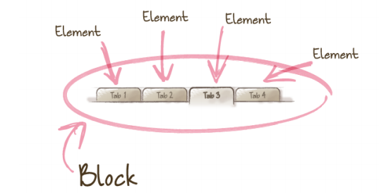

# Fragen CAS-FEE - Prüfungsvorbereitung

## [15] 07.09.2016 - Komplexe Sites modular strukturieren

### Was versteht man unter dem Shame.css?
von Benjamin Rüde - Dienstag, 29. November 2016, 17:24

a) Dies ist eine TsLint Erweiterung für unsaubere CSS-Selectoren. Durch Einsatz dieser Erweiterung können sehr komplexe Selectoren verhindert werden.
b) Ist ein eine CSS Datei welches durch einen Autoprefixer gelaufen ist und nun komplett vollgeschrieben ist mit Vendor Prefixes.
c) Ist die abwertende Bezeichnung für eine CSS Datei welche nicht nach den BEM Vorgaben aufgebaut ist.
d) Eine CSS File in welchem alle unschönen Selectoren oder CSS Hacks zusammenfasst werden zur besseren Übersicht. Im Idealfall können diese Selectoren oder Hacks zu einem späteren Zeitpunkt behoben / ersetzt werden.

Lösung:
d)

### Was ist ein BEM Mix?
von Patrick Bonetti - Mittwoch, 14. September 2016, 20:07

Von einem BEM Mix spricht man, wenn einem einzelnen DOM-Node mehrere BEM Entities zugewiesen werden.
Beispiel:

```html
<ul class="menu">
   <!-- BEM Mix aus einem Element (menu__item) und einem Block (block-link) -->
   <li class="menu__item block-link"></li>
   <!---->
   <li>...</li>
</ul>
```

Ein BEM Mix kann aus verschiedenen Arten von Entities bestehen, z.B. Block und Block, Block und Element, Element und Element.

Anwendungsmöglichkeiten: "Mixes allow us to:
- Combine the behaviors and styles of several BEM entities while avoiding code duplication
- Create semantically new interface components on the basis of existing BEM entities."

=> https://en.bem.info/methodology/key-concepts/#mix

### Welche dieser BEM Naming Regeln sind falsch?
von Michael Hüppi - Mittwoch, 14. September 2016, 09:59

a) Zahlen, Buchstaben und Sonderzeichen sind erlaubt
b) Alles in Kleinschreibung
c) In englischer Sprache
d) Wort Trennung mit zwei Bindestrichen "--"
e) "Element" Trennung mit zwei Unterstrichen "\_\_"
f) "Modifier" Trennung mit einem Unterstrich "\_"

Antwort a und d

### Atomic Design: Beispiel Navigation
von Michael Hüppi - Mittwoch, 14. September 2016, 09:58

Du entwirfst ein Template nach dem Atomic Design Ansatz. In der Navigation (3 Menupunkte) soll ein Suchfeld integriert sein.
Aus welchen Elementen besteht diese Navigation (1-stufig) und wie heissen diese Bausteine im Atomic Design?

Navigation - Organism

Menu - Molecule
Menu-Item 1 - Atom
Menu-Item 2 - Atom
Menu-Item 3 - Atom

Suchfeld - Molecule
Label - Atom
Eingabefeld - Atom
Suche-Button - Atom

### Welche der drei folgenenden class-Definitionen entsprechen dem Prinzip von BEM?
von Peter Bartholet - Montag, 12. September 2016, 09:06

Antwort 1
```html
<form class="form_login">
    <input class="form__input">
    <input class="form__submit form__submit__disabled">
</form>
```

Antwort 2
```html
<form class="form_login">
    <input class="form__input">
    <input class="form_submit form_submit_disabled">
</form>
```

Antwort 3
```html
<form class="form_login">
    <input class="form__input">
    <input class="form__submit form__submit_disabled">
</form>
```

Antwort 4
```html
<form class="form_login">
    <input class="form--input">
    <input class="form--submit form-submit-disabled">
</form>
```

Richtige Antwort:  
Antwort 3

### Weshalb sollte man keine ID Referenzen zum stylen von Elementen verwenden?
von Noel Bellón - Sonntag, 11. September 2016, 22:26

Weil man dann Probleme mit der Modularisierung des Codes bekommen kann, da ein valides HTML Dokument nur ein einziges Element mit der selben ID enthält. Somit könnte ein Modul nur ein Mal pro Seite eingesetzt werden.

Das selbe gilt wenn man ID's als Referenzen für JavaScript-Bindings verwendet.

### Welche Frontend-Methodologie wurde hier angewendet?
von Robert Stucki - Sonntag, 11. September 2016, 19:07

```html
<form class="form_login">
 <input class="form__input">
 <input class="form__submit form__submit_disabled">
</form>
```

Auswahl:
- Atomic Design
- BEM
- OCCS / SMACSS
- OOBEMITSCSS

Richtige Antwort:  
2

### Was besagt das Gesetz von Demeter? Gebe ein Beispiel
von Michel Rimbeaux - Sonntag, 11. September 2016, 14:06

Das Gesetz von Demeter (englisch: Law of Demeter, kurz: LoD) ist eine Entwurfs-Richtlinie in der objektorientierten Softwareentwicklung. Sie besagt im Wesentlichen, dass Objekte nur mit Objekten in ihrer unmittelbaren Umgebung kommunizieren sollen. Dadurch soll die Kopplung (das heißt die Anzahl von Abhängigkeiten) in einem Softwaresystem verringert und somit die Wartbarkeit erhöht werden.

Beispiel: https://de.wikipedia.org/wiki/Gesetz_von_Demeter#Beispiel

### Welches sind die zwei Grundsätze von OOCSS?
von Anton Kammermeier - Donnerstag, 8. September 2016, 21:03

- Separieren von Struktur und Inhalt
- Separieren von Struktur und Stil
- Separieren von Container und Inhalt
- Separieren von Inhalt und Stil

Antwort:  
2 und  3

Beschreibung:  
https://github.com/stubbornella/oocss/wiki

### Nenne die Grundbausteine von Atomic Design.
von Marc Labud - Donnerstag, 8. September 2016, 19:55

- Atom
- Molekül
- Organismus
- Template
- Page

### Wie könnte man die gleichzeitige Nutzung von Klassen für CSS und Javascript vermeiden?
von Patrik Dietschweiler - Donnerstag, 8. September 2016, 10:12

Einführung von Js-* prefix für Javascript abhängige Klassen

Beispiel:
```html
<div class="lightbox js-lightbox">
  <div class="js-author-generation"> ... </div>
  <div class="box">
    <ul class="categories">
      <li> ... </li>
    </ul>
  </div>
  <div class="js-sharing">
    <a href="http://facebook.com">Facebook <span class="js-sharing-account">hsr.ch</span></a>
    <a href="http://twitter.com">Twitter <span class="js-sharing-account">@hsr</span></a>
  </div>
</div>
```

### Was ist BEM?
von Marcel Tinner - Donnerstag, 8. September 2016, 08:40

BEM (Block Element Modifier) ist eine weit verbreitete Methode/Naming Convention wie CSS aufgebaut werden kann. Dabei werden Objekte je nach zugehörigkeit Eingeteilt. Eine Gruppe von Elementen z.B. Listitems bzw. eine Liste wird dabei als Block betrachtet. Der einzelne Baustein der Gruppe als Element z.B. ein Listitem. Das selektierte Item als Modifier.

Dabei gibt es Class Naming Conventions beim CSS häufig verbreitet ist folgende:
- `.list {}` für Block
- `.list__item {}` für ein Listeneintrag
- `.list__item--selected {}` für den einzelnen selektierten Listeneintrag



### Warum sollten in CSS grundsätzlich keine ID-Selektoren verwendet werden?
von Rafael Bamert - Donnerstag, 8. September 2016, 00:32

IDs
- sind unique, d.h. es wird nur 1 HTML-Element selektiert
- besitzen eine unnötig hohe Spezifitiät, was das Überschreiben dieser CSS-Rules erschwert (http://oli.jp/img/2011/important-inheritance.png)

### Outline - Strukturbereinigung
von Daniel Kellenberger - Mittwoch, 7. September 2016, 19:05

Gegeben:
```html
<h1>This is my website</h1>
<section>
 <h1>Main Content</h1>
 <article>
   <header>
     <h1>My Title</h1>
   </header>
   <h1>My Content</h1>
   <footer>
     <h1>My Footer</h1>
     <h2>My Sitemap</h2>
   </footer>
 </article>
</section>
```

Dies erzeugt folgende Outline Struktur:
\1. This is my website
\1. Main Content
\1. My Title
\2. My Content
\3. My Footer
\1. My Sitemap
\2. Side Content
\3. Sidebar

Wie kann erreicht werden, dass 'My Content' unter 'My Title' eingerückt ist?

Antwort:

Mittels:
```html
<section> um den Content
<h1>My Content</h1> => <h2>My Content</h2>
```

### Nenne je zwei Vor- und Nachteile für CSS-Styleguides
von Tobias Buechel - Mittwoch, 7. September 2016, 17:27

Pro
- Code wird einfacher zum testen
- Gemeinsame Arbeitsweise
- Einheitlicher Referenzpunkt
- Allgemeine Übersicht
- Gut zu verkaufen

Contra
- Zeitintensiv
- Fehlende Dokumentation
- Missinterpretationen
- Dient meist als “Hilfsprojekt”
- Teilweise abstrakt und outdated / unvollständig
- Wenige patterns etabliert
- Mangelnde Generatoren
