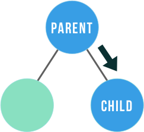
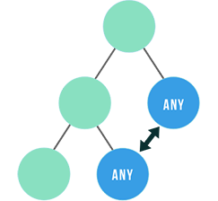

# Fragen CAS-FEE - Prüfungsvorbereitung

## [20] 26.10.2016 - Grosse Anwendung mit React

### SPA mit React
von Michael Hüppi - Mittwoch, 30. November 2016, 06:03

Was brauchst du alles, wenn du mit React eine komplexe SPA entwickeln möchtest, wie du sie mit angular2 realisieren würdest?

- ReactJS
- Redux (bzw. irgendeine Flux-Implementation)
- React Router

### Redux Store
von Raphael Hirscher - Mittwoch, 23. November 2016, 12:09

Welche Idee steckt hinter dem Store bei Redux, der den State enthält?

Antwort:

Der Store implementiert die Idee der Immutability.
Hierbei handelt es sich beim Store um ein grosses Javascript-Objekt, welches nie verändert wird. Treffen State-Veränderungen ein, wird eine neue Version des Objekts mit dem neuen State erschaffen. Damit wird auch ermöglicht, dass zwischen den States hin und her gesprungen werden kann.

Lektüre dazu:

https://developer.mozilla.org/en/docs/Web/JavaScript/Reference/Global_Objects/Object/assign

### Welche states sollten eher nicht in Redux abgelegt werden?
von Thilo Holzer - Mittwoch, 16. November 2016, 18:38

UI-States. Natürlich könnten diese trotzdem in redux abgelegt werden. Aber gerade wenn der globale Store komplexe Strukturen bereithält, kann es Perfomance-Mässig Sinn machen, einen lokalen Store für UI-States zu führen.

### Ab wann sollte man eine Lib wie Redux verwenden?
von Thilo Holzer - Mittwoch, 16. November 2016, 18:33

Sobald komplexere Strukturen verwaltet werden sollen oder aber wenn der State über die ganze Applikation verfügbar sein muss/soll.

### Welches sind die drei fundamentalen Konzepte von Redux? (eine Antwort)
von Patrick Bonetti - Dienstag, 1. November 2016, 23:52

a) State, Props, Lifecycle methods  
b) Store, Action, Reducer  
c) State, Mutable Data, Promises  
d) Stores, Dispatcher, Reducer

Lösung:  
b)

### Welches sind die 8 nicht-Flux Strategien für React component communication?
von Michel Rimbeaux - Sonntag, 30. Oktober 2016, 17:22

**Parent to Child Communication**  

- [1. Props](http://andrewhfarmer.com/component-communication/#1-props)
- [2. Ref Functions](http://andrewhfarmer.com/component-communication/#2-ref-functions)

**Child to Parent**  

- [3. Callback Functions](http://andrewhfarmer.com/component-communication/#3-callback-functions)
- [4. Event Bubbling](http://andrewhfarmer.com/component-communication/#4-event-bubbling)

**Sibling to Sibling**  

- [5. Parent Component](http://andrewhfarmer.com/component-communication/#5-parent-component)

**Any to Any**  

- [6. Observer Pattern](http://andrewhfarmer.com/component-communication/#6-observer-pattern)
- [7. Global Variables](http://andrewhfarmer.com/component-communication/#7-global-variables)
- [8. Context](http://andrewhfarmer.com/component-communication/#8-context)

### Wie unterscheiden sich Container von Components?
von Tobias Buechel - Donnerstag, 27. Oktober 2016, 11:12

Components sind einfache ("dumme") UI-Elemente, die in der App wiederverwendet werden können. Sie bekommen ihren State als Props von den Container injected. Container kümmern sich um die Verteilung der Daten (State) und Actions in die Components.

### Was ist die Aufgabe des Reducer in Redux?
von Patrik Dietschweiler - Mittwoch, 26. Oktober 2016, 21:01

a)   Reduziert die Anzahl der State update events  
b)   Haltet der aktuelle Application State  
c)   Spezifiziert wie der Application State verändert wird.

Lösung:  
c
